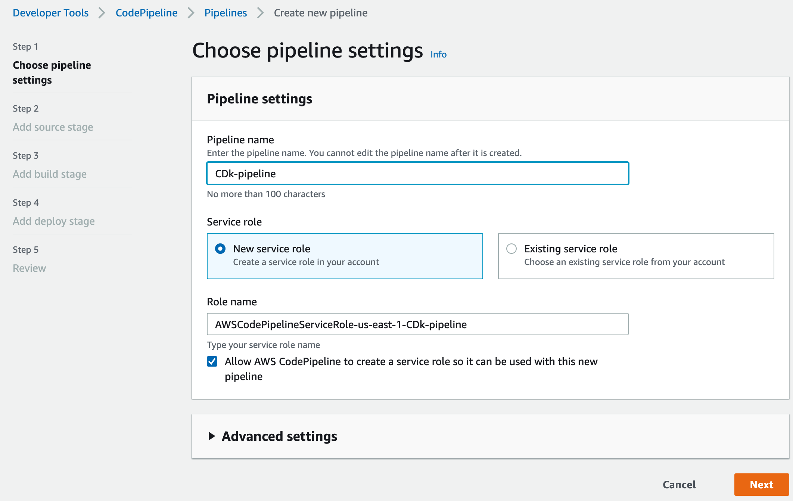
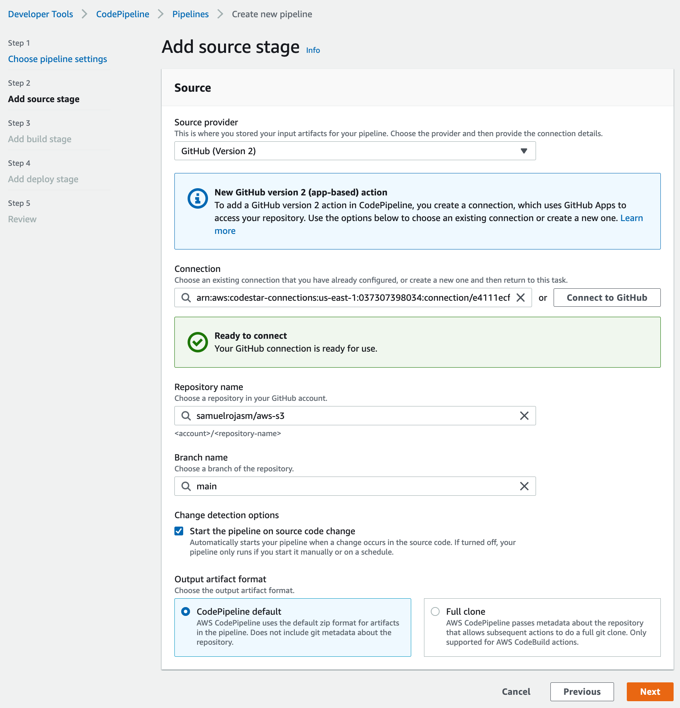
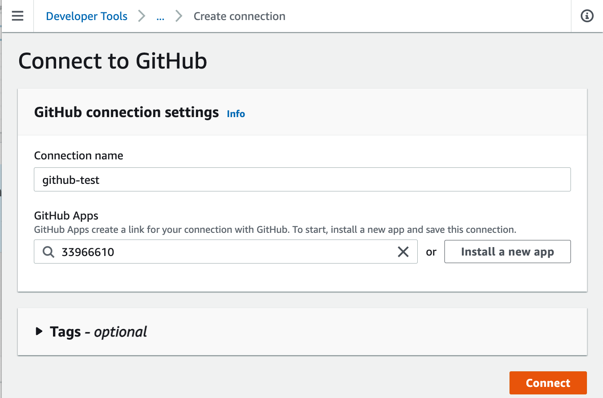
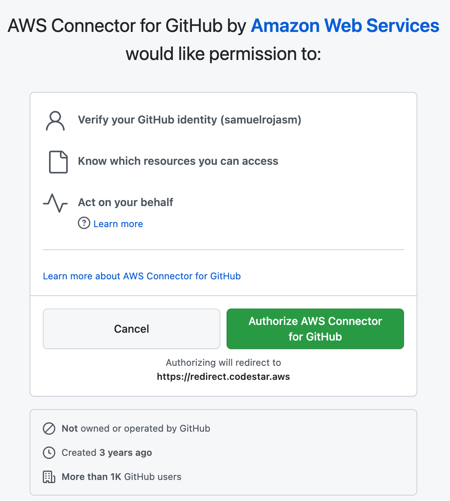
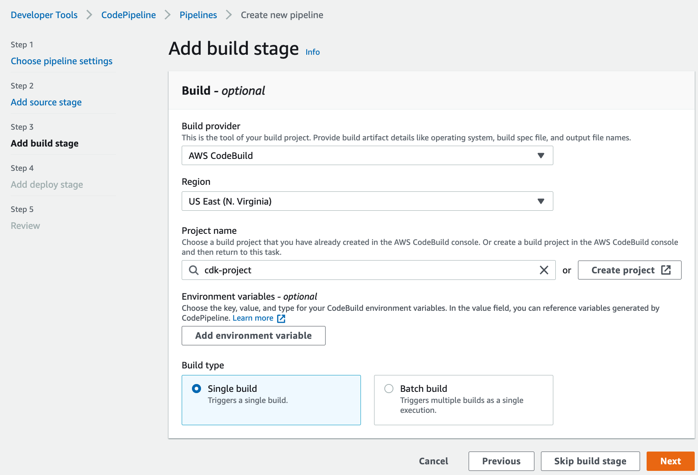
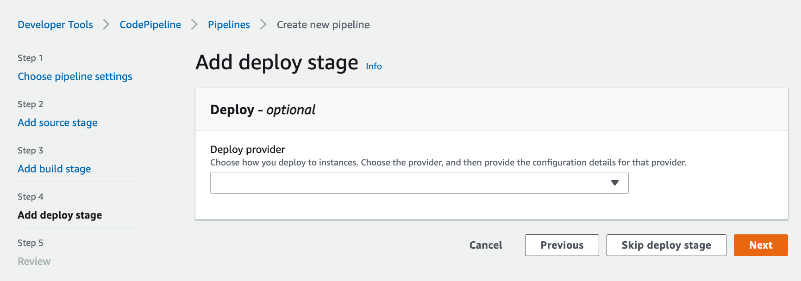
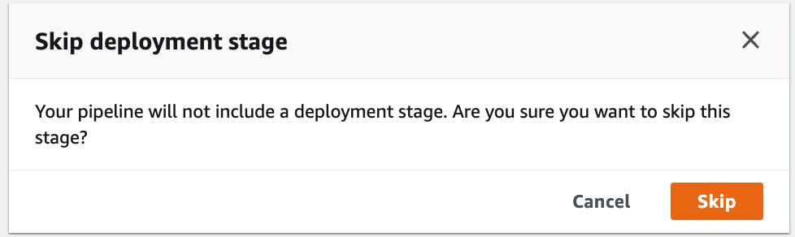
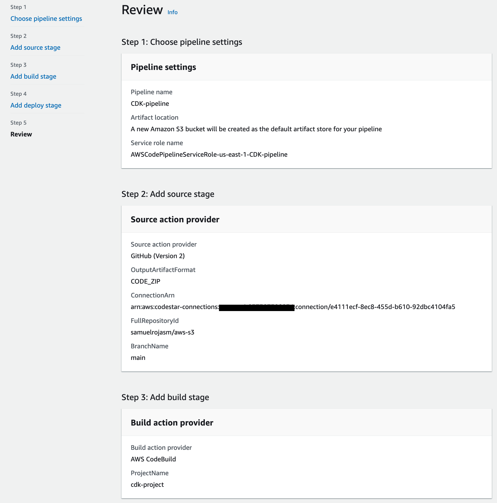

# Introducción
El objetivo es la creación de un CI/CD pipeline para los proyectos de **AWS CDK**. Esta guía es para crear el pipeline desde la consola con el objetivo de entender de manera general como trabajan los servicios de AWS Developer tools y verificar los detalles para después crear el proceso de manera automatizada e integralo con el ecosistema de AWS.

## Conceptos básicos involucrados
- **CI/CD** hace referencia a Continuous Integration y Continuous Delivery e introduce automatización y monitoreo del proceso completo de SDLC(Software Development Lifecycle).

- **Continuous Integration (CI)** es una práctica de desarrollo de software en la que los desarrolladores combinan regularmente sus cambios de código en un repositorio central, después de lo cual se ejecutan builds y pruebas automatizadas.
    - Encontrar y corregir errores más rápidamente
    - Mejorar la calidad del software
    - Reducir el tiempo que lleva validar y lanzar nuevas actualizaciones de software
    - La integración continua se enfoca en la integración de commits y cambios de código pequeños

- **Continuous delivery (CD)** es una práctica de desarrollo de software en la que los cambios de código se crean, prueban y preparan automáticamente para su lanzamiento en producción.

    - Automatizar el proceso de release de software
    - Mejorar la productividad del desarrollador
    - Mejorar la calidad del código
    - Entregar actualizaciones más rápido
    - El objetivo de Continuous delivery no es aplicar todos los cambios a la producción inmediatamente, sino asegurarse de que todos los cambios estén listos para pasar a producción.

## AWS CodePipeline para AWS CDK
El objetivo es crear la solución con la consola de AWS porque ayuda a comprender cómo funcionan los servicios involucrados.

1. En el servicio AWS CodePipeline seleccionamos la opción Create pipeline. Comenzamos con Step 1 con las configuraciones iniciales:

2. En el Step 2 se configura el origen de código. Al seleccionar la opción de GitHub version 2, se debe de crear la nueva conexión con la opción "Connect to Github":

3. Seleccionar o crear "Git Hub App". Para crear una nueva, se usa la opción "Install new app" 

4. Autorizamos la solicitud de acceso a Github de AWS, después se puede dar el acceso a todos los repositorios o solo a los seleccionados. Cuando la conexión con Gthub está lista regresa a la pantalla del Step 2:

5. Cuando la conexión con Github está lista regresa a la pantalla del Step 2, en donde seleccionamos el repositorio y el branch.

6. En el Step 3: "Add build stage", seleccionar la opción "AWS CodeBuild" para poder usar este servicio para crear comandos personalizados. Seleccionamos la region, nombre del proyecto y single build:

7. El Step 4: "Add the deploy stage", saltamos este paso ya que no se necesita:

8. CodePipeline está listo para su creación, se muestra una pantalla de revisión. Confirmar y crear CodePipeline. Se crean dos stages: Source y Build:
