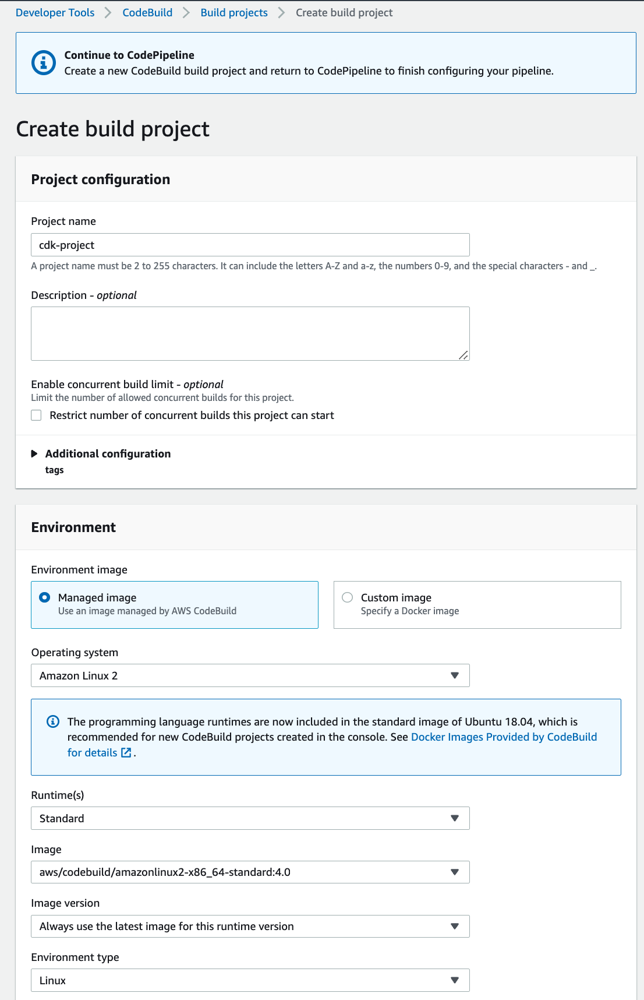
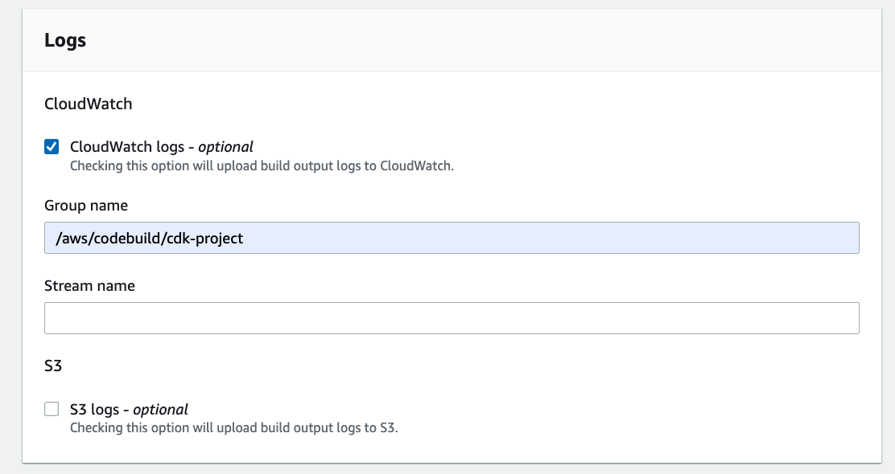
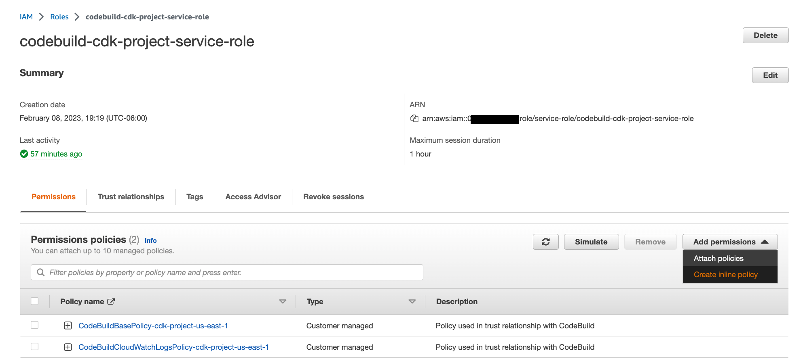

# Introducción
El objetivo es la creación de un CI/CD pipeline para los proyectos de **AWS CDK**. Esta guía es para crear el pipeline desde la consola con el objetivo de entender de manera general como trabajan los servicios de AWS Developer tools y verificar los detalles para después crear el proceso de manera automatizada e integralo con el ecosistema de AWS.

## Conceptos básicos involucrados
- **CI/CD** hace referencia a Continuous Integration y Continuous Delivery e introduce automatización y monitoreo del proceso completo de SDLC(Software Development Lifecycle).

- **Continuous Integration (CI)** es una práctica de desarrollo de software en la que los desarrolladores combinan regularmente sus cambios de código en un repositorio central, después de lo cual se ejecutan builds y pruebas automatizadas.
    - Encontrar y corregir errores más rápidamente
    - Mejorar la calidad del software
    - Reducir el tiempo que lleva validar y lanzar nuevas actualizaciones de software
    - La integración continua se enfoca en la integración de commits y cambios de código pequeños

- **Continuous delivery (CD)** es una práctica de desarrollo de software en la que los cambios de código se crean, prueban y preparan automáticamente para su lanzamiento en producción.

    - Automatizar el proceso de release de software
    - Mejorar la productividad del desarrollador
    - Mejorar la calidad del código
    - Entregar actualizaciones más rápido
    - El objetivo de Continuous delivery no es aplicar todos los cambios a la producción inmediatamente, sino asegurarse de que todos los cambios estén listos para pasar a producción.

## AWS CodePipeline para AWS CDK
El objetivo es crear la solución con la consola de AWS porque ayuda a comprender cómo funcionan los servicios involucrados.

### Step 1: Choose pipeline settings
1. En el servicio AWS CodePipeline seleccionamos la opción Create pipeline. Comenzamos con Step 1 con las configuraciones iniciales:
<p align="center">
    
</p>

### Step 2: Add source stage
1. En el Step 2 se configura el origen de código. Al seleccionar la opción de GitHub version 2, se debe de crear la nueva conexión con la opción "Connect to Github":
<p align="center">
    
</p>

2. Seleccionar o crear "Git Hub App". Para crear una nueva, se usa la opción "Install new app" 
<p align="center">
    
</p>

3. Autorizamos la solicitud de acceso a Github de AWS, después se puede dar el acceso a todos los repositorios o solo a los seleccionados:
<p align="center">
    
</p>

4. Cuando la conexión con Github está lista regresa a la pantalla inicial del Step 2, en donde seleccionamos el repositorio y el branch.

### Step 3: Add build stage
1. En el Step 3: "Add build stage", seleccionar la opción "AWS CodeBuild" para poder usar este servicio para crear comandos personalizados. Seleccionamos la region, nombre del proyecto y single build:
<p align="center">
    
</p>

2. Es necesario crear un proyecto de AWS CodeBuild, seleccionando la opción "Create project". Crear el proyecto de Build con las siguientes opciones:
- Operating System: Amazon Linux 2
- Runtime(s): Standard
- Image: Seleccionar la versión más actual
- Service role: New service role
- Buildspec: **Insert build commands** y click en **Switch to editor** y adicionar lo siguiente:

```yaml
version: 0.2
phases:
  install:
    commands:
      - npm install --location=global npm
      - npm install -g python
      - npm install -g aws-cdk
  build:
    commands:
      - npm ci
      - npm run build
      - cdk deploy
```

- Adicionar a CloudWatch log, seleccionad como **Group name** /aws/codebuild/cdk-project

<p align="center">
    <br>
    <br>
    
</p>

3. Cómo funciona la implementación de CDK:
Nota:  Validar si es necesario, correr el pipeline antes de asignar los permisos descrietos en este paso.
- Detrás de escena, cuando el comando **cdk deploy** se ejecuta, CDK usa las funciones de CDK creadas en el proceso de arranque para realizar algunas acciones: realizar una búsqueda, cargar archivos y hacer deploy de la plantilla cargada en el S3 en el servicio de CloudFormation.
- El rol CodeBuild role asume el rol CDK para ejecutar  los comandos CDK, por lo que hay que especificar los permisos para el nue rol.
- Por lo tanto, es necesario actualizar el rol de CodeBuild para agregar el permiso de los roles de CDK. Para hacer esto, crear un nuevo permiso (new inline policy).
- Adiconar Action **sts:AssumeRole** y los recursos de los cuatro roles CDK creados en el bootstrap.
<p align="center">
    
</p>
### Step 4: Add deploy stage
1. El Step 4: "Add the deploy stage", saltamos este paso ya que no se necesita:
<p align="center">
    <br>
    
</p>

### Step 5: Review
1. CodePipeline está listo para su creación, se muestra una pantalla de revisión. Confirmar y crear CodePipeline. Se crean dos stages: Source y Build:
<p align="center">
    
</p>