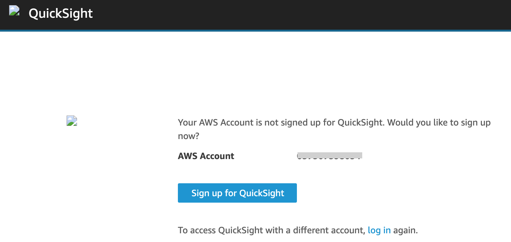
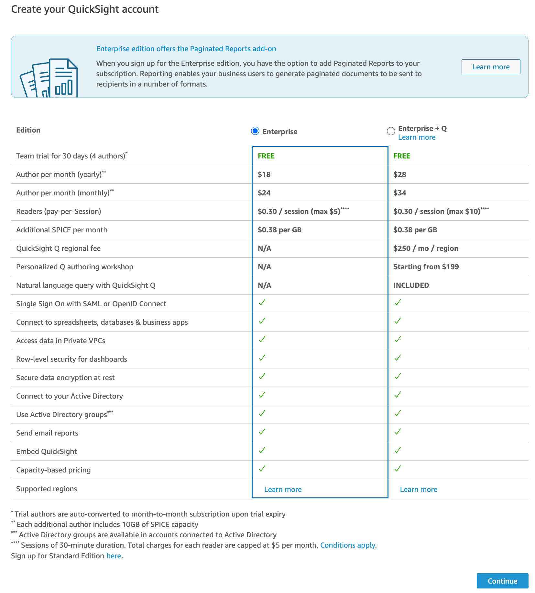
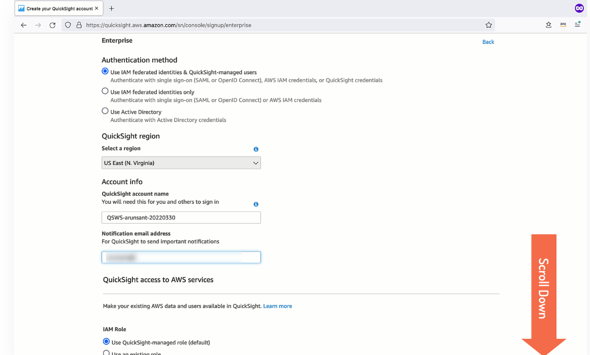
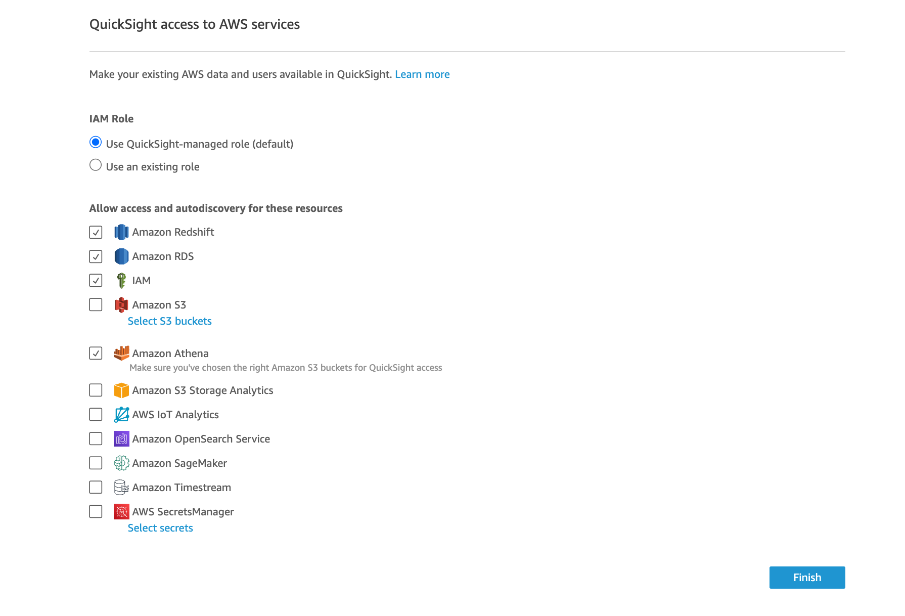
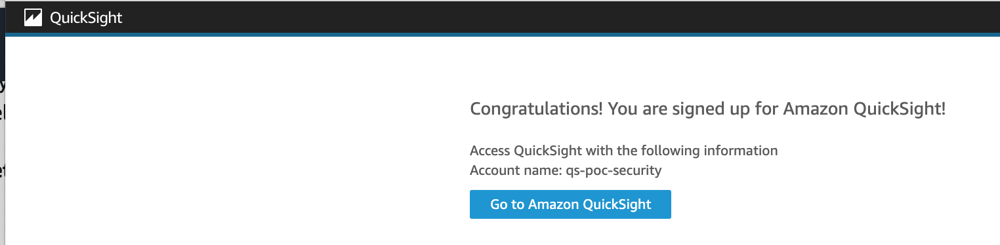
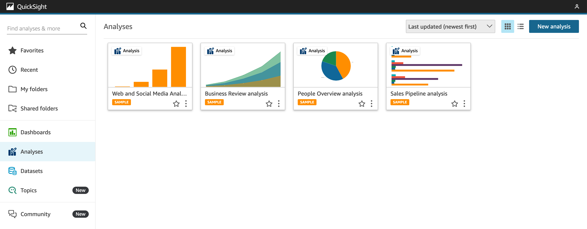

# Introducción

## Configurar QuickSight
* En el caso que sea la primera vez que se usa QuickSight en una cuneta específica es necesario como primer paso crear la cuenta.
1. Buscar el servicio QuickSight
1. En la pagina de QuickSight, dar click en el boton `Sign up for QuickSight`.
    

        
    

1. Seleccionar la edición Enterprise que es la de default
    

        
    

1. Ingresar los datos de los campos:
    - QuickSight account name
    - Notification email address
    

        
    

1. Presionar el botón `Finish`
    

        
    

1. Click en `Go to Amazon QuickSight`
    

        
    

1. Inicia la consola de QuickSight
    

        
    
