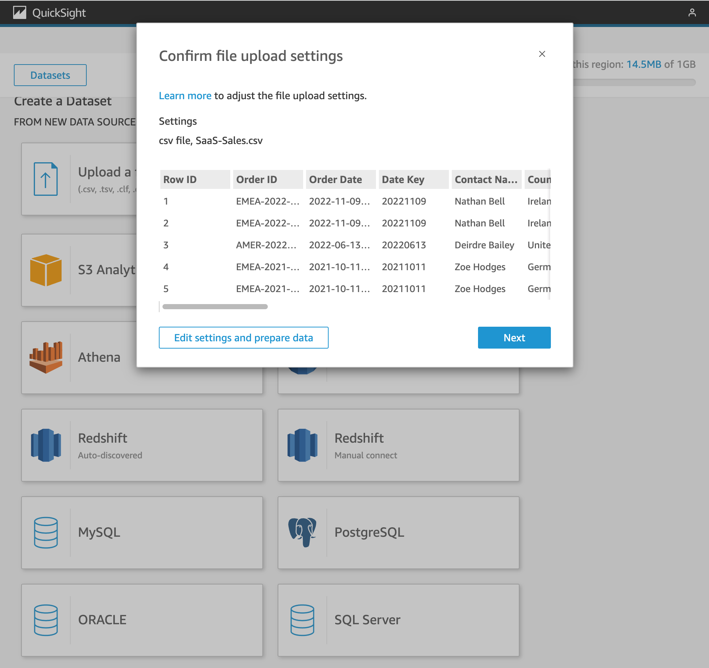
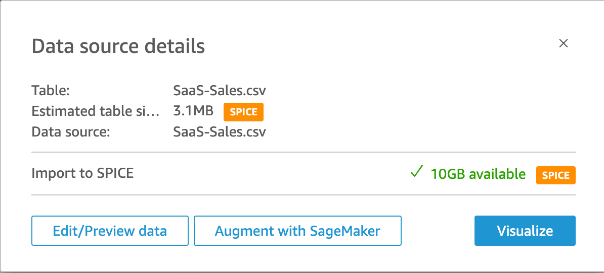
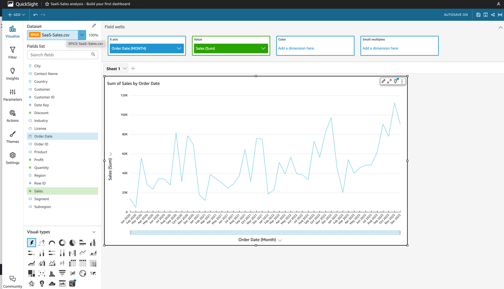

# Introducción

## Configurar QuickSight
* En el caso que sea la primera vez que se usa QuickSight en una cuneta específica es necesario como primer paso crear la cuenta.
1. Buscar el servicio QuickSight
1. En la pagina de QuickSight, dar click en el boton `Sign up for QuickSight`.
    

        
    

1. Seleccionar la edición Enterprise que es la de default
    

        
    

1. Ingresar los datos de los campos:
    - QuickSight account name
    - Notification email address
    

        
    

1. Presionar el botón `Finish`
    

        
    

1. Click en `Go to Amazon QuickSight`
    

        
    

1. Inicia la consola de QuickSight
    

        
    

## Construye tu primer dashboard
### Crear el dataset
1. Seleccionar la opción `Datasets`
1. Seleccionar el botón `New dataset`
1. Seleccionar la primera opción `Upload a file`
1. Crragar el archivo `SaaS-Sales.csv` que se localiza en los recursos
    

        
    

1. Seleccionar `Next`
1. Seleccionar `Visualize` Aquí es donde se pueden añadir elementos visuales, ajustar el diseño y publicar el dashboard.
    

        
    

1. Hacer click en el nombre predeterminado del panel superior para acceder al modo de edición.
1. Cambiar el nombre `SaaS-Sales analysis - Build your first dashboard`
1. Hacer click fuera del cuadro de nombre para salir del modo de edición de nombre.

### Visualizar ventas por mes
1. En `Fields list` seleccionar `Sales` y  `Order Date`
1. Haga clic en la flecha situada junto a la etiqueta Order Date del eje X y elija la opción `Aggregate->Month.` 
Como alternativa, puede desplegar la sección Field Wells en la parte superior de la pantalla, utilizar la flecha en el campo `Order Date` y cambiar `Aggregate->Month`
    

        
    

## Referencias
- [QuickSight Workshops](https://catalog.workshops.aws/quicksight/en-US)